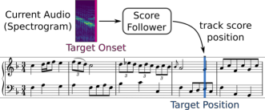
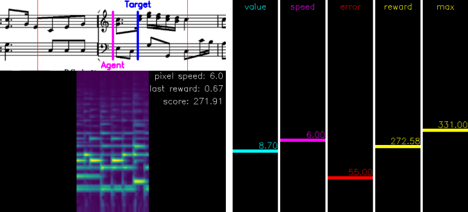

# Score Following as a Multi-Modal Reinforcement Learning Problem

This repository contains the corresponding code for our article:
>[Henkel F.](https://www.jku.at/en/institute-of-computational-perception/about-us/people/florian-henkel/), 
>[Balke S.](https://www.jku.at/en/institute-of-computational-perception/about-us/people/stefan-balke/),
>[Dorfer M.](https://www.jku.at/en/institute-of-computational-perception/about-us/people/matthias-dorfer/), and [Widmer G.](https://www.jku.at/en/institute-of-computational-perception/about-us/people/gerhard-widmer/)<br>
"[Score Following as a Multi-Modal Reinforcement Learning Problem](http://doi.org/10.5334/tismir.31)".<br>
*Transactions of the International Society for Music Information Retrieval*, 2019

which is an invited extension of the work presented in:
>[Dorfer M.](https://www.jku.at/en/institute-of-computational-perception/about-us/people/matthias-dorfer/), [Henkel F.](https://www.jku.at/en/institute-of-computational-perception/about-us/people/florian-henkel/), and [Widmer G.](https://www.jku.at/en/institute-of-computational-perception/about-us/people/gerhard-widmer/)<br>
"[Learning to Listen, Read, and Follow: Score Following as a Reinforcement Learning Game](https://arxiv.org/pdf/1807.06391.pdf)".<br>
*In Proceedings of the 19th International Society for Music Information Retrieval Conference*, 2018

Score following is the process of tracking a
musical performance (audio) with respect to
a known symbolic representation (a score).
The figure below shows a sketch of this task.



In our paper we formulate score following
as a multimodal Markov Decision Process (MDP),
the mathematical foundation for sequential decision making.
Given this formal definition,
we can address the score following task with state-of-the-art reinforcement learning (RL) algorithms.
In particular, **the goal is to design multimodal RL agents
that simultaneously learn to listen to music,
read the scores from images of sheet music,
and follow the audio along in the sheet, in an end-to-end fashion**.
All this behavior should be learned entirely from scratch,
based on a weak and potentially delayed reward signal
that indicates to the agent how close it is to the correct position in the score.

## Demo Video
To get a better intuition for the task and problem at hand,
you can also watch this short video showing how an Actor-Critic agent gradually learns to
interact with the score following game.
[](https://www.youtube.com/watch?v=COPNciY510g)

We would also like to emphasise a view aspects of the score following game that make it,
besides a nice [MIR](https://en.wikipedia.org/wiki/Music_information_retrieval) application,
also an interesting machine learning problem:
- It is a reinforcement learning problem with training, validation and test set.
This allows us to **investigate the generalization abilities**
of reinforcement learning algorithms and network architectures.
The ultimate goal are score following agents generalizing to complete unseen musical pieces (scores)
as well as audio conditions.
- It is a **multimodal representation learning problem**.
This could open doors to explore concepts such as [DCCA](http://proceedings.mlr.press/v28/andrew13.html),
that already worked well for other multimodal applications.
- It **involves interaction with humans**.
Ideally we end up with agents that are general enough to follow human performers.

## Getting Started
Before we can start working with the score following game,
we first need to set up a few things:

### Setup and Requirements
First, clone the project from github.
```
git clone git@github.com:CPJKU/score_following_game.git
```

Navigate to the directory
```
cd score_following_game
```

As a next step you need to install the required packages. If your are an anaconda user,
we  provide an [anaconda environment file](https://conda.io/docs/user-guide/tasks/manage-environments.html#creating-an-environment-from-an-environment-yml-file)
which can be installed as follows:
```
conda env create -f environment.yml
```

In case you prefer to not use conda, we also provide you with a *requirements.txt* file that can be installed by
```
pip install -r requirements.txt
```

Activate your conda environment:
```
source activate score_following
```

and install the *score_following_game* package in develop mode:
```
python setup.py develop --user
```

This is what we recommend, especially if you want to try out new ideas.

Finally, you will also need the [*Baselines*](https://github.com/openai/baselines) package by OpenAI.
Please follow their instructions and install the package within your environment.

### Software Synthesizer - FluidSynth
Make sure that you have [fluidsynth](http://www.fluidsynth.org/) available on your system.
We will need it to synthesise the audios from MIDI.
Synthesising the audios and computing spectrograms will take a while
but it is done only once when training an agent for the first time.

### Check if the Score Following Game works
Once you have installed all packages and downloaded the data
everything should be ready to train the models.
To check if the game works properly on your system you can run the following script and
play the game on your own.
```
python test_agent.py --data_set ./data/test_sample --piece Anonymous__lesgraces__lesgraces --game_config game_configs/mutopia_lchs1.yaml --agent_type human 
```
With the key "right" you can increase the agents pixel progression speed,
with "left" you can decrease it.
Remember, the goal is to collect as much reward as possible.

**Important**: If you are a MAC user you have to add your terminal application (e.g. iTerm)
to the list of accessibility input devices (system control -> security & privacy -> accessibility).

If you don't want to play on your own,
you can also run an optimal agent. (This will create a video in the folder *videos*.)
```
python test_agent.py --data_set ./data/test_sample --piece Anonymous__lesgraces__lesgraces --game_config game_configs/mutopia_lchs1.yaml --agent_type optimal 
```

**Important**: This wont work on a server without a x-window system
so ideally you check it on a desktop machine.
This holds also if you want to visually inspect the performance of your trained agents.
Then you will also need to have a cuda-capable GPU available on your desktop system.

## Data Preparation for Training an Agent
Our experiments and the score following game
are based on the [Nottingham database](https://ifdo.ca/~seymour/nottingham/nottingham.html)
and the [MSMD dataset](https://github.com/CPJKU/msmd).
For the score following game we wont need the entire content delivered with these data sets
so we provide a preprocessed version of both ready for download.

The easiest way to get started is to simply run the following script
which will automatically download and prepare the data set for you.
```
python prepare_game_data.py --destination <PATH-TO-DATA-ROOT>
```
If automatically downloading and preparing the data fails for any reason
just download it manually from [here](http://www.cp.jku.at/resources/2019_RLScoFo_TISMIR/data.tar.gz)
and extract it to your desired data path <PATH-TO-DATA-ROOT>.

Note: For simplicity we only use one soundfont for synthesizing the audios in this repository.

## Training an Agent
To train a model on a specific data set, learning algorithm and network architecture
you can start with our suggested commands below.

**Note**: Our *experiment.py* training script has a very verbose command line
and we rely on the default parametrization for the following exemplar calls.
If you want to try different agent configurations please run
```
python experiment.py --help
```
to learn more.

### Train PPO Agent on Nottingham (monophonic):
```
python experiment.py --net ScoreFollowingNetNottinghamLS --train_set <PATH-TO-DATA-ROOT>/nottingham/nottingham_train --eval_set <PATH-TO-DATA-ROOT>/nottingham/nottingham_valid --game_config game_configs/nottingham_ls1.yaml --log_root <LOG-ROOT> --param_root <PARAM-ROOT> --agent ppo
```

### Train PPO Agent on MSMD (polyphonic):
```
python experiment.py --net ScoreFollowingNetMSMDLCHSDeepDoLight --train_set <PATH-TO-DATA-ROOT>/msmd_all/msmd_all_train --eval_set <PATH-TO-DATA-ROOT>/msmd_all/msmd_all_valid --game_config game_configs/mutopia_lchs1.yaml --log_root <LOG-ROOT> --param_root <PARAM-ROOT> --agent ppo
```

### Logging with [Tensorboard](https://github.com/tensorflow/tensorboard)

We use tensorboard to watch our training progress.
If you have all packages installed you can start it with:
```
tensorboard --logdir <LOG-ROOT>
```

Once tensorboard is running you should be able to view it in your browser at *http://localhost:6006*.


## Evaluating an Agent

To investigate the performance of your trained agents you have the following two options:

### An Audio-Visual Quality Check
To get an intuition on how well your agents work
you can visualize its performance on a particular piece.
Just run the following command and you will get a rendering
similar to the one provided in the youtube video above.

```
python test_agent.py --params <PARAM-ROOT>/<run_id>/best_model.pt --data_set <PATH-TO-DATA-ROOT/nottingham/nottingham_test --piece <PIECE-NAME> --game_config game_configs/nottingham_ls1.yaml --agent_type rl 
```

If everything works out fine this is what you should see
(for an explanation of the components please see the youtube video above):



### Computing the Numbers
To compute the performance measures over the entire training, validation or test set
you can run the following command.
```
python evaluate_agent.py --trials 1 --params <PARAM-ROOT>/<run_id>/best_model.pt --data_set <PATH-TO-DATA-ROOT/nottingham/nottingham_test
```
This should produce something like this, reporting the ratio of correctly tracked onsets for each test piece:
```
reels_simple_chords_53                                       tracking ratio: 0.57
reels_simple_chords_203                                      tracking ratio: 1.00 +
jigs_simple_chords_29                                        tracking ratio: 1.00 +
...
```

Recall that the agent's are following a stochastic policy.
So we recommend to increase the number of evaluation trials (for example to 10 as in our paper)
to get more robust estimates.


## Trying out a Pre-trained Agent
If you would like to try out a pre-trained agent here is a recipe how can do it:
We assume here that the data is already set up as explained above.

- we provide you with the pre-trained models in the folder *models*.
- run the command below.
- optional: change the number of evaluation trails in the command below to 1 for a quick check. Run the full 10 evaluations to see how stable the model is.

```
python evaluate_agent --trials 10 --params ./models/<PATH-TO-PRETRAINEDMODEL>/best_model.pt --data_set <PATH-TO-DATA-ROOT>/msmd_all/msmd_all_test
```
**Note**: If you keep the folder name as we provide it, the network and configuration file will be automatically derived. 
For our best PPO agent you should get a similar output as the following (differences are due to the stochastic behavior of the RL agent):
```
& 0.82 & 0.82 & 0.67 & 0.85 \\
& 0.80 & 0.77 & 0.65 & 0.80 \\
& 0.81 & 0.80 & 0.66 & 0.81 \\
& 0.80 & 0.81 & 0.65 & 0.79 \\
& 0.79 & 0.80 & 0.65 & 0.81 \\
& 0.84 & 0.78 & 0.63 & 0.79 \\
& 0.79 & 0.80 & 0.67 & 0.85 \\
& 0.81 & 0.78 & 0.67 & 0.83 \\
& 0.84 & 0.82 & 0.66 & 0.80 \\
& 0.78 & 0.78 & 0.63 & 0.79 \\
--------------------------------------------------
& 0.81 & 0.80 & 0.65 & 0.81 \\
```
The last row is the average over all 10 evaluation trials.

If you want to see how the pre-trained model performs on a single piece run the following command (this will create a video in the *videos* folder):

```
python test_agent.py --params ./models/<PATH-TO-PRETRAINEDMODEL>/best_model.pt --data_set <PATH-TO-DATA-ROOT>/msmd_all/msmd_all_test --piece BachJS__BWV117a__BWV-117a --agent_type rl
```

